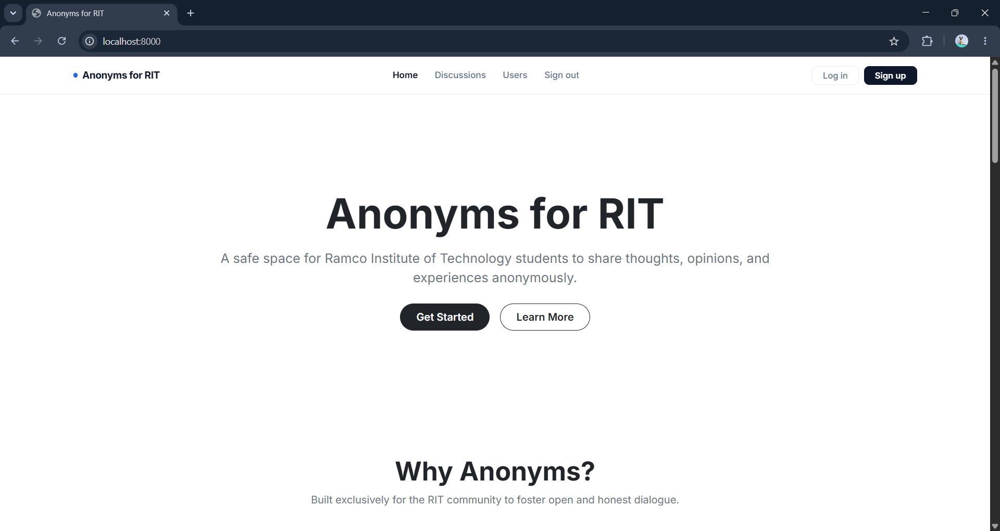
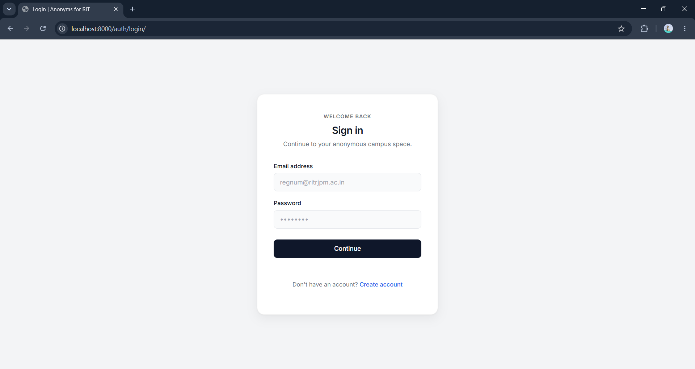
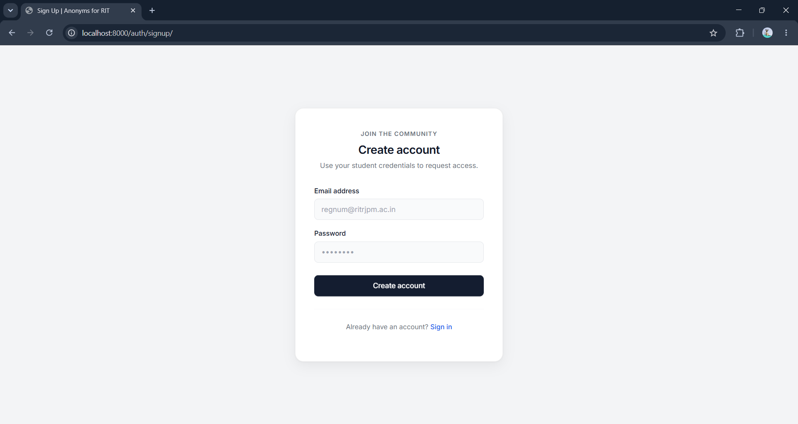
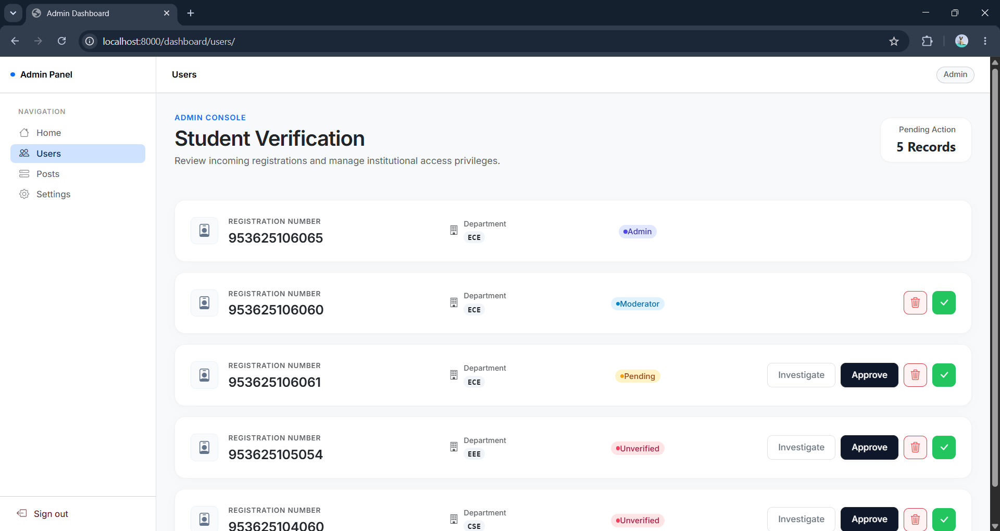
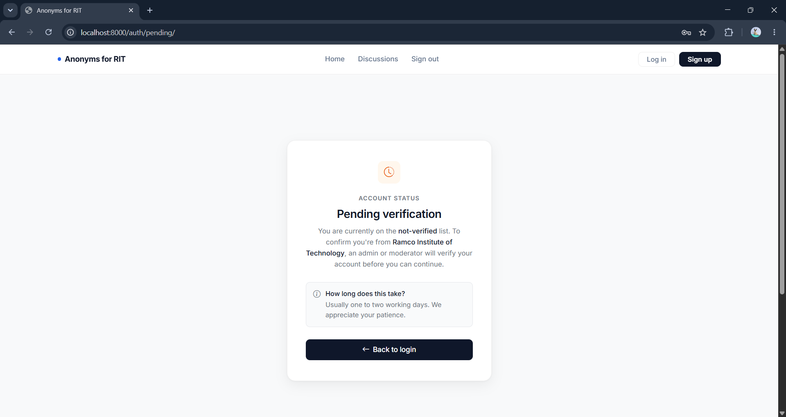
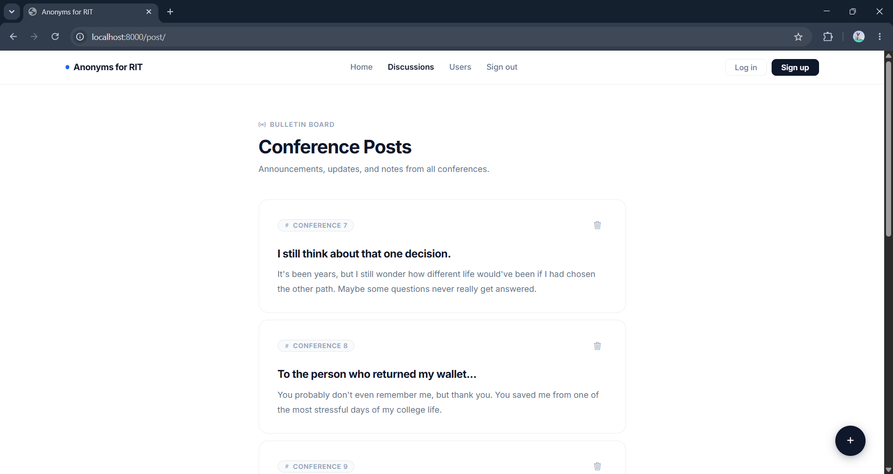
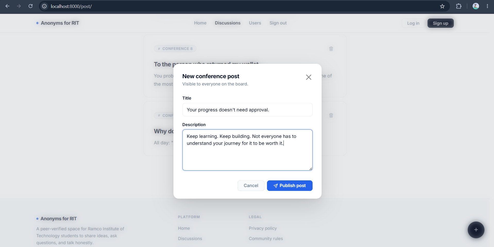
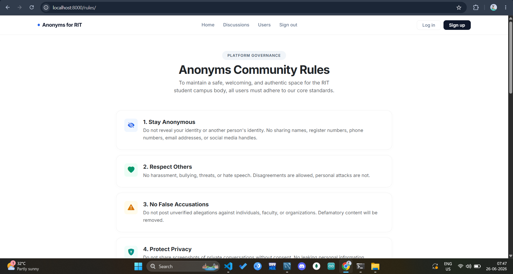
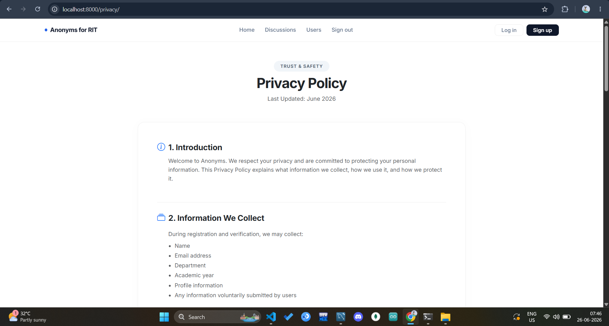

# Anonyms

A secure, anonymous social platform built exclusively for verified college students. Users authenticate with institutional credentials and require administrator approval before accessing the platform. Once verified, students can create and read posts in a privacy-focused environment where their identities are never publicly exposed.

---

## Table of Contents

- [Overview](#overview)
- [Tech Stack](#tech-stack)
- [Features](#features)
- [URL Structure](#url-structure)
- [Database Models](#database-models)
- [Project Structure](#project-structure)
- [Installation](#installation)
- [Environment Variables](#environment-variables)
- [Screenshots](#screenshots)
- [Security](#security)
- [Future Improvements](#future-improvements)
- [Contributing](#contributing)
- [License](#license)
- [Author](#author)

---

## Overview

Anonyms addresses a common problem in student communities: the need for honest, open discussion without fear of social repercussions. By combining institutional verification with anonymous posting, it ensures that only legitimate students participate while protecting individual identities.

The platform enforces a multi-step verification flow. New registrants are placed in a pending state until an administrator approves them. Verified users can post and read content freely. Administrators and moderators have dedicated dashboards for user management.

---

## Tech Stack

**Backend**

- Python
- Django

**Frontend**

- HTML5
- CSS3
- Bootstrap 5
- JavaScript

**Database**

- MySQL

**Authentication**

- Custom Django user model with email-based authentication

**Deployment**

- Render

---

## Features

### Authentication

- Email-based login and logout
- User registration with institutional details
- Pending verification page for new accounts
- Custom authentication backend
- Custom user model replacing Django's default

### User Verification

Students register with the following information:

- Email address
- Register number
- Department
- Graduation year

New accounts are assigned `not-verified` status by default. Administrators can transition accounts between the following states:

| Status | Description |
|---|---|
| `not-verified` | Newly registered, awaiting review |
| `pending` | Under administrator consideration |
| `verified` | Approved and able to access the platform |

### Roles

Three roles govern platform access and capabilities:

| Role | Capabilities |
|---|---|
| Student | Create posts, view posts, delete own posts |
| Moderator | Student capabilities plus elevated moderation access |
| Admin | Full platform control including user management and role promotion |

Administrators can promote any student to moderator from the dashboard.

### Posts

Verified users can:

- Create anonymous posts with a title and description
- View all posts on the platform
- Delete their own posts

The author's identity is stored in the database and linked internally, but is never surfaced in the public-facing interface.

### Administration Dashboard

The admin dashboard provides the following controls:

- View all registered users and their verification status
- Approve user verification
- Move users back to pending status
- Delete user accounts
- Promote students to moderator role

### Static Pages

- Home
- Rules
- Privacy Policy

---

## URL Structure

**Main Routes**

```
/
├── admin/
├── auth/
├── dashboard/
└── post/
```

**Authentication**

```
/auth/login/
/auth/logout/
/auth/signup/
/auth/pending/
```

**Core**

```
/
/rules/
/privacy/
```

**Dashboard**

```
/dashboard/users/
/dashboard/users/<id>/verify/
/dashboard/users/<id>/pending/
/dashboard/users/<id>/delete/
/dashboard/users/<id>/promotetomoderator/
```

**Posts**

```
/post/
/post/create/<id>/
/post/delete/<id>/
```

---

## Database Models

### User

| Field | Type | Description |
|---|---|---|
| `email` | EmailField | Primary identifier, used for login |
| `register_number` | CharField | Institutional registration number |
| `department` | CharField | Academic department |
| `graduation_year` | IntegerField | Expected graduation year |
| `is_verified` | CharField | Verification status: `not-verified`, `pending`, `verified` |
| `role` | CharField | User role: `student`, `moderator`, `admin` |

### Post

| Field | Type | Description |
|---|---|---|
| `user` | ForeignKey | Reference to the author (not publicly exposed) |
| `title` | CharField | Post title |
| `description` | TextField | Post body content |

---

## Project Structure

```
anonyms/
|
+-- authentication/         # Registration, login, logout, pending view
+-- core/                   # Home, rules, privacy policy
+-- customeAdmin/           # Admin dashboard and user management
+-- post/                   # Post creation, listing, deletion
+-- static/                 # CSS, JavaScript, and static assets
+-- anonyms/                # Project settings and root URL configuration
+-- manage.py
+-- requirements.txt
```

---

## Installation

### Prerequisites

- Python 3.10 or higher
- MySQL server running locally or remotely
- pip

### Steps

**1. Clone the repository**

```bash
git clone https://github.com/muthugopi/anonymc.git
cd anonyms
```

**2. Create and activate a virtual environment**

```bash
python -m venv .venv

# Windows
.venv\Scripts\activate

# Linux / macOS
source .venv/bin/activate
```

**3. Install dependencies**

```bash
pip install -r requirements.txt
```

**4. Configure environment variables**

Create a `.env` file in the project root. See [Environment Variables](#environment-variables) for required keys.

**5. Apply database migrations**

```bash
python manage.py migrate
```

**6. Create a superuser**

```bash
python manage.py createsuperuser
```

**7. Start the development server**

```bash
python manage.py runserver
```

The application will be available at `http://127.0.0.1:8000/`.

---

## Environment Variables

Create a `.env` file in the project root directory. Never commit this file to version control.

```env
DEBUG=True

DB_NAME=your_database_name
DB_USER=your_database_user
DB_PASSWORD=your_database_password
DB_HOST=127.0.0.1
DB_PORT=3306
```

| Variable | Description |
|---|---|
| `DEBUG` | Set to `True` for development, `False` for production |
| `DB_NAME` | Name of the MySQL database |
| `DB_USER` | MySQL user with access to the database |
| `DB_PASSWORD` | Password for the MySQL user |
| `DB_HOST` | Host where MySQL is running |
| `DB_PORT` | Port MySQL is listening on (default: 3306) |

Add `.env` to your `.gitignore` file:

```
.env
```

---

## Screenshots

**Home Page**



**Login**



**Signup**



**Dashboard**



**User Verification**



**Posts**



**Create Post**



**Rules**


**Privacy**


---

## Security

Anonyms incorporates the following security measures:

- **CSRF protection** via Django's built-in middleware, applied to all state-changing requests
- **Django authentication framework** for session management and credential handling
- **Login-required decorators and mixins** to prevent unauthenticated access to protected views
- **Custom user model** with email-based authentication, removing reliance on username-based defaults
- **Role-based authorization** restricting admin and moderator capabilities to authorized users only
- **Anonymous identity protection** ensuring author identity is stored server-side and never included in public responses
- **SQL injection protection** through Django's ORM parameterized queries
- **XSS protection** via Django's automatic template escaping
- **Secure password hashing** using Django's PBKDF2 algorithm with a random salt

---

## Future Improvements

The following enhancements are planned or under consideration:

- Like and reaction system for posts
- Anonymous comment threads on posts
- Post reporting and moderation queue
- Search functionality across posts
- Post categories and tags
- Image upload support for posts
- In-platform notifications
- Dark mode toggle
- User profile management (without exposing identity)
- Pagination for post and user lists
- Rich text editor for post creation
- Advanced moderation tools for content filtering
- Analytics dashboard for administrators
- REST API with token-based authentication
- Docker and docker-compose support for local development
- CI/CD pipeline with automated testing and deployment

---

## Contributing

Contributions are welcome. Please follow the steps below to propose changes.

**1. Fork the repository**

Click the Fork button on the GitHub repository page to create your own copy.

**2. Create a feature branch**

```bash
git checkout -b feature/your-feature-name
```

**3. Commit your changes**

```bash
git commit -m "Add: brief description of changes"
```

**4. Push the branch**

```bash
git push origin feature/your-feature-name
```

**5. Open a Pull Request**

Navigate to the original repository and open a Pull Request from your branch. Provide a clear description of the changes and the problem they solve.

Please ensure your code follows the existing project structure and that any new functionality is tested before submitting.

---

## License

This project is licensed under the MIT License.

```
MIT License

Copyright (c) 2026 [Muthugopi J]

Permission is hereby granted, free of charge, to any person obtaining a copy
of this software and associated documentation files (the "Software"), to deal
in the Software without restriction, including without limitation the rights
to use, copy, modify, merge, publish, distribute, sublicense, and/or sell
copies of the Software, and to permit persons to whom the Software is
furnished to do so, subject to the following conditions:

The above copyright notice and this permission notice shall be included in all
copies or substantial portions of the Software.

THE SOFTWARE IS PROVIDED "AS IS", WITHOUT WARRANTY OF ANY KIND, EXPRESS OR
IMPLIED, INCLUDING BUT NOT LIMITED TO THE WARRANTIES OF MERCHANTABILITY,
FITNESS FOR A PARTICULAR PURPOSE AND NONINFRINGEMENT. IN NO EVENT SHALL THE
AUTHORS OR COPYRIGHT HOLDERS BE LIABLE FOR ANY CLAIM, DAMAGES OR OTHER
LIABILITY, WHETHER IN AN ACTION OF CONTRACT, TORT OR OTHERWISE, ARISING FROM,
OUT OF OR IN CONNECTION WITH THE SOFTWARE OR THE USE OR OTHER DEALINGS IN THE
SOFTWARE.
```

---

## Author

**[Muthugopi J]**

- GitHub: [github.com/yourusername](https://github.com/muthugopi)
- LinkedIn: [linkedin.com/in/yourprofile](https://linkedin.com/in/muthugopi-j-848459371)
- Email: muthugopij@gmail.com
